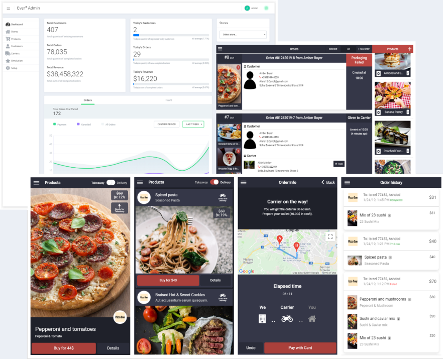

# Цифровой рынок с множественными магазинами



- [Admin Website](http://localhost:4200), используйте электронную почту администратора: `admin@emarket.com`, пароль: `admin`
- [Shopping Mobile App](http://localhost:4201)
- [Merchant Ionic Tablet App](http://localhost:4202), используйте электронную почту владельца магазина: `merchant@emarket.com`, пароль: `123456`
- [Carrier Mobile App](http://localhost:4203)
- [Shopping Website](http://localhost:3000), используйте электронную почту клиента, сгенерированного случайно (можно узнать через админ панель): `xxx@xxx.com`, пароль: `123456`

## Особенности

- Поддерживает маркет с одним и несколькими магазинами / несколькими поставщиками;
- Все реактивно, в режиме реального времени и очень быстро;
- Платформа беззаголовочной торговли, которая позволяет реализовывать различные магазины, пользовательские интерфейсы администратора и клиентские приложения. Предоставляет богатые
  API для GraphQL, REST и WS;
- Мобильное приложение для заказов для клиентов, чтобы делать заказы по требованию (гибридный / PWA, iOS и Android с использованием Ionic / Ionic Native);
- Мобильное приложение перевозчика (водителя) для доставки перевозчиками, водителями или поставщиками услуг (iOS и Android с использованием Ionic / Ionic Native);
- Настройка веб-сайта электронной коммерции для покупок, чтобы клиенты могли совершать покупки товаров или услуг в браузере;
- Торговое планшетное приложение для магазинов/продавцов/складов для управления и отслеживания заказов, организации поставок и т.д.;
- Веб-сайт администратора, используемый для управления всеми функциями и настройками платформы в едином веб-интерфейсе;
- Многоязычные и культурные настройки всюду в платформе (i18N);
- Каталоги товаров (глобальные и для каждого продавца) с несколькими изображениями товаров;
- Управление складами и управление/обработка заказов в режиме реального времени на платформе;
- Управление поставками/доставкой и обработка на платформе (доставка с отслеживанием местоположения заказов в режиме реального времени);
- Скидки, акции и обновления доступности товаров/услуг в режиме реального времени;
- Регистрация клиентов, гостевой заказ, приглашения (по желанию);
- Шлюз и обработка платежей (не завершена);
- Плагины/Расширения/Пользовательские поля (WIP).

## Технологический стек и требования

- [TypeScript](https://www.typescriptlang.org);
- [NodeJs](https://nodejs.org) / [NestJs](https://github.com/nestjs/nest);
- [Ionic](https://ionicframework.com) (v5) для мобильного приложения для покупок, доставщика и приложения для планшета продавца;
- Торговый сайт разработан с помощью [Angular](https://angular.io) (v9.1) с использованием [Angular Starter](https://github.com/gdi2290/angular-starter);
- Сайт администратора разработан с помощью [Angular](https://angular.io) (v9.1) с использованием [ngx-admin](https://github.com/akveo/ngx-admin);
- Бэкенд/Сервер разработан с помощью [Nest](https://github.com/nestjs/nest) с использованием модуля Pyro. Поддерживает API реального времени GraphQL, REST и WS (WebSocket с
  использованием библиотеки [Socket.io](https://socket.io));
- [RxJS](http://reactivex.io/rxjs) библиотека, используемая в большой степени во всех частях платформы;
- [InversifyJS](http://inversify.io) используется для управления инверсией / внедрения зависимостей в большинстве частей платформы. В бэкэнде/API также используется DI,
  предоставляемые [Nest](https://github.com/nestjs/nest);
- [MongoDB](https://www.mongodb.com) База данных, используется с [Mongoose](https://mongoosejs.com) ORM (поддерживаемая версия MongoDB >= 3.2; рекомендуется версия >=4). Можно управлять данными через [MongoDB Compass](https://www.mongodb.com/try/download/compass);
- Для продакшена, интегрирован и рекомендуется использовать [PM2](https://github.com/Unitech/pm2)

#### См. также README.md и CREDITS.md файлы в соответствующих папках со списками библиотек и программного обеспечения, включенных в Платформу, информацией о лицензиях и другими подробностями.

## Документация

Для быстрого обзора каждого проекта на Платформе (Сервер, Администратор, Магазины и т.д.) Вы можете выполнить поиск README.md файл в корневой папке проектов. Например,
см. [./core/README.md](packages/core/README.md) обзор, связанный с сервером (бэкендом).

## Приступая к работе

### Клонируйте репозиторий

Клонируйте Git репозиторий:

```
git clone https://github.com/alvinahmadov/emarket.git
```

### Yarn

В настоящее время используется "Yarn" (вместо "npm"), поэтому перед запуском платформы убедитесь, что у вас установлена последняя версия Yarn:

```
npm install -g yarn@latest
```

### Быстрая установка

После клонирования репозитория git просто выполните следующую команду для установки/начальной загрузки всех зависимостей:

```
yarn bootstrap
```

Приведенная выше команда устанавливает необходимые пакеты во всех проектах платформы, использующих Lerna.

**Примечание**: если по какой-либо причине вышеприведенная команда завершится неудачно, вы можете попытаться установить необходимые пакеты вручную, запустив "yarn" в каждой
подпапке папки "пакеты" с файлом "package.json".

### Сборка

Вы можете создать все проекты, используя одну команду ниже:

```
yarn build:all
```

**Примечание**: параллельная сборка доступна с помощью команды `yarn build`

### Lerna (ручная установка)

Используется Lerna для управления монорепозиториями.

Вам нужно выполнить следующую команду из рабочей папки, в которой вы клонировали репозиторий git, который устанавливает Lerna вместе с другими пакетами:

```
yarn
```

Вместо этого вы можете установить Lerna по глобально:

```
npm install lerna@latest -g
```

Теперь, после установки Lerna (локально или глобально), вам необходимо загрузить все зависимости вручную:

```
yarn lerna bootstrap
```

Приведенная выше команда устанавливает все необходимые пакеты для каждого подпроекта Платформы.

**Примечание**: если по какой-либо причине вышеприведенная команда завершится неудачно, вы можете попытаться установить необходимые пакеты вручную, запустив "yarn" в каждой
подпапке с файлом "package.json".

После загрузки Lerna все, что вам нужно, чтобы запустить сборку для всех проектов, как описано выше в разделе '[Сборка](#Сборка)'.

### MongoDB

Платформа настроена на использование MongoDB по умолчанию и предполагает, что служба MongoDB запущена и принимает подключения на локальном хосте по умолчанию:27017. Пожалуйста,
смотрите [документацию](https://docs.mongodb.com/) для MongoDB.

### Запуск подпроектов платформы

После того, как вы все построите, каждый проект может быть запущен одной командой из этого списка:

- Запустите сервер `yarn run:server`
- Запустите сайт администратора `yarn run:admin` и откройте http://localhost:4200
- Запустите мобильное приложение для покупок `yarn run:shopmobile` и откройте http://localhost:4201
- Запустите приложение для торговца `yarn run:merchant` и откройте http://localhost:4202
- Запустите мобильное приложение для доставщика app `yarn run:carrier` и откройте http://localhost:4203
- Запустите сайт `yarn run:shopweb` и откройте http://localhost:3000

**Примечание 1**: важна предсборка общих модулей платформы (`yarn build:common` or `yarn build:all`) перед запуском платформы (API) или приложений.

**Примечание 2**: во время разработки вы можете запустить сервер с помощью "yarn run:server:dev", чтобы включить наблюдение за изменениями файлов TS

**Примечание 3**: при первом запуске сервер API (серверная часть) создает локальную базу данных MongoDB "ever_development" со следующим (по умолчанию) администратором

- почта: `admin@emarket.com`
- пароль: `admin`

Вы можете использовать указанные выше учетные данные для входа в приложение администратора платформы.

**Примечание 4**: чтобы иметь возможность запускать каждый проект, вам нужно убедиться, что все построено, см. раздел '[Сборка](#Сборка)' выше.

## Безопасность

В производственной настройке все связи между клиентом и сервером (серверная часть, API) должны быть зашифрованы с использованием HTTPS/WSS/SSL (API REST, конечная точка GraphQL,
Сокет.веб-сайты ввода-вывода и т.д.).
